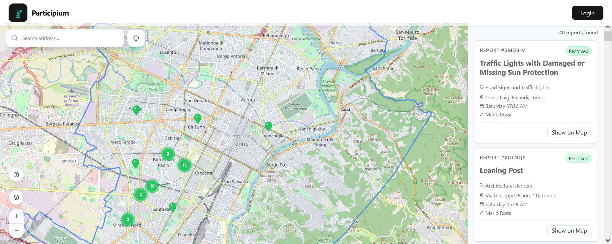
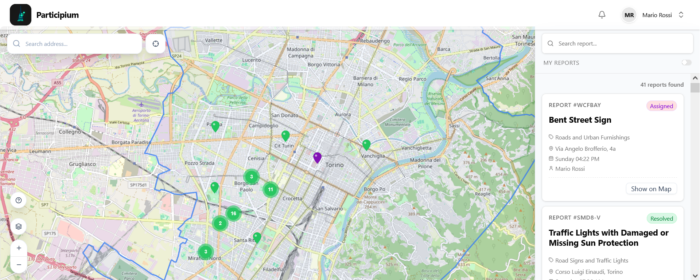
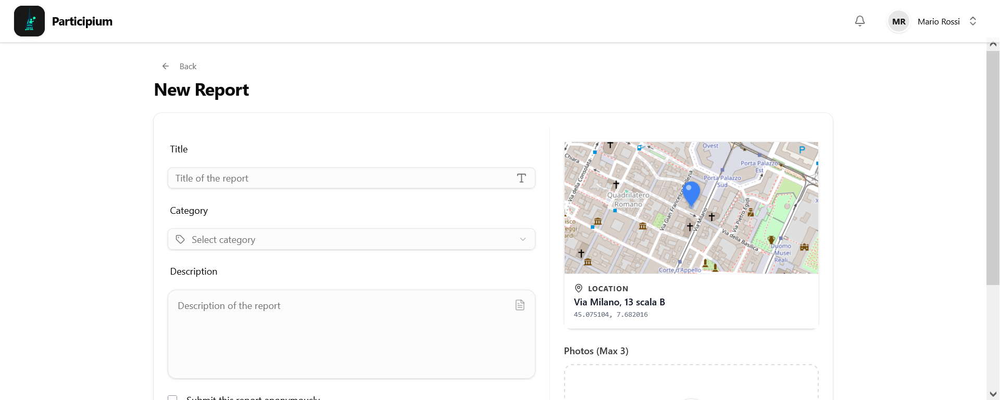
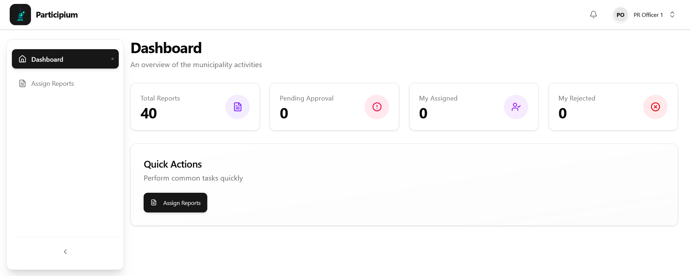

# Participium - Municipal Services Portal

Participium is a full‑stack municipal services portal developed as a university assignment by a team of six. It enables citizens to submit geolocated reports with photos and lets municipal staff review, triage, and manage those reports using role-based dashboards and map views. The project demonstrates full-stack skills including backend APIs, frontend interfaces, geospatial data handling, and object storage.

- Backend: NestJS (TypeScript) — see `apps/api`
- Frontend: React + Vite (TypeScript) — see `apps/web`
- Database: PostgreSQL with PostGIS for geospatial queries
- Object storage: MinIO for report attachments

Screenshots:






---

# Quick Start (Full Stack Deployment)

The recommended way to run the full Participium stack (Frontend + Backend + Database + Storage) is using Docker Compose. This ensures all services share the correct network and volumes

## Prerequisites

**Important:** The application requires a `.env` file with valid credentials for external services:
- **SMTP Server** - for sending email notifications
- **Telegram Bot Token** - for Telegram bot integration

See `.env.example` in the repository for all required environment variables. Copy it to `.env` and fill in your credentials:

```bash
cp .env.example .env
# Edit .env with your SMTP and Telegram Bot credentials
```

Without a properly configured `.env` file, the application will fail to start.

## 1. Create a compose.yml file

Copy the following content into a file named docker-compose.yml:

```
name: participium-release

services:
  api:
    image: giova21/participium-api:latest
    pull_policy: always
    container_name: participium-api
    restart: always
    depends_on:
      - postgres
      - minio
    environment:
      PORT: 5000
      NODE_ENV: ${NODE_ENV:-production}
      FRONTEND_URL: ${FRONTEND_URL:-http://localhost:5173}
      BACKEND_URL: ${BACKEND_URL:-http://localhost:5000/api}
      POSTGRES_HOST: postgres
      POSTGRES_PORT: 5432
      POSTGRES_USER: ${POSTGRES_USER:-admin}
      POSTGRES_PASSWORD: ${POSTGRES_PASSWORD:-password}
      POSTGRES_DB: ${POSTGRES_DB:-participium}
      MINIO_ENDPOINT: minio
      MINIO_PORT: 9000
      MINIO_PUBLIC_ENDPOINT: ${MINIO_PUBLIC_ENDPOINT:-localhost}
      MINIO_PUBLIC_PORT: ${MINIO_PUBLIC_PORT:-9000}
      MINIO_ROOT_USER: ${MINIO_ROOT_USER:-minioadmin}
      MINIO_ROOT_PASSWORD: ${MINIO_ROOT_PASSWORD:-minioadmin}
      MINIO_BUCKET_NAME: ${MINIO_BUCKET_NAME:-participium-reports}
      MINIO_USE_SSL: ${MINIO_USE_SSL:-false}
      EMAIL_HOST: ${EMAIL_HOST}
      EMAIL_PORT: ${EMAIL_PORT:-587}
      EMAIL_SECURE: ${EMAIL_SECURE:-false}
      EMAIL_USER: ${EMAIL_USER}
      EMAIL_PASSWORD: ${EMAIL_PASSWORD}
      EMAIL_FROM: ${EMAIL_FROM:-noreply@participium.com}
      TELEGRAM_BOT_TOKEN: ${TELEGRAM_BOT_TOKEN}
      TELEGRAM_USE_WEBHOOK: ${TELEGRAM_USE_WEBHOOK:-false}
      TELEGRAM_WEBHOOK_URL: ${TELEGRAM_WEBHOOK_URL}
      TELEGRAM_MAX_REPORTS_PER_HOUR: ${TELEGRAM_MAX_REPORTS_PER_HOUR:-5}
      COOKIE_HTTP_ONLY: ${COOKIE_HTTP_ONLY:-true}
      COOKIE_SECURE: ${COOKIE_SECURE:-false}
      COOKIE_SAME_SITE: ${COOKIE_SAME_SITE:-lax}
      SESSION_EXPIRES_IN_SECONDS: ${SESSION_EXPIRES_IN_SECONDS:-86400}
    ports:
      - "5000:5000"
    networks:
      - participium-net

  web:
    image: giova21/participium-web:latest
    pull_policy: always
    container_name: participium-web
    restart: always
    ports:
      - "5173:80"
    depends_on:
      - api
    networks:
      - participium-net

  postgres:
    image: postgis/postgis:18-3.6
    platform: linux/amd64
    container_name: participium-postgres
    restart: unless-stopped
    environment:
      POSTGRES_USER: ${POSTGRES_USER:-admin}
      POSTGRES_PASSWORD: ${POSTGRES_PASSWORD:-password}
      POSTGRES_DB: ${POSTGRES_DB:-participium}
    volumes:
      - participium_pg_data:/var/lib/postgresql
    networks:
      - participium-net

  minio:
    image: minio/minio:latest
    container_name: participium-minio
    restart: unless-stopped
    environment:
      MINIO_ROOT_USER: ${MINIO_ROOT_USER:-minioadmin}
      MINIO_ROOT_PASSWORD: ${MINIO_ROOT_PASSWORD:-minioadmin}
    volumes:
      - participium_minio_data:/data
    command: server /data --console-address ":9001"
    networks:
      - participium-net
    ports:
      - "9001:9001"
      - "9000:9000"

volumes:
  participium_pg_data:
    name: participium_release_pg_data
  participium_minio_data:
    name: participium_release_minio_data

networks:
  participium-net:
    driver: bridge
```

## 2. Start the application

Run the following command in your terminal:

```
docker compose up -d
```

## 3. Access the services

- **Web App:** http://localhost:5173

- **API Documentation:** http://localhost:5000/api

- **MinIO Console:** http://localhost:9001

# Technical Details

## Architecture Components

| Service  | Image                   | Internal Port | Description                                                                                              |
| :------- | :---------------------- | :------------ | :------------------------------------------------------------------------------------------------------- |
| Backend  | giova21/participium-api | 5000          | Built with Node.js 20 (Alpine). Handles business logic, seeds data, and connects to services via TypeORM |
| Frontend | giova21/participium-web | 80            | Built with Vite. Static assets served via high-performance Nginx (Alpine) reverse proxy                  |
| Database | postgis/postgis:18-3.6  | 5432          | PostgreSQL 18 extended with PostGIS for geospatial queries and storage                                   |
| Storage  | minio/minio:latest      | 9000          | S3-Compatible object storage for storing report images and assets                                        |

## Data Persistence

Data is persisted using Docker named volumes to ensure it survives container restarts:

- **`participium_release_pg_data`** stores the relational database and geospatial index

- **`participium_release_minio_data`** stores the uploaded files/blobs

To reset the data completely, run:

```
docker compose down -v
```

🔐 Demo Credentials (Auto-Seeded)

On the first run, the system **automatically seeds** the database with sample users, geolocated reports in Turin, and municipal boundaries for testing:
| Role | Username | Password|
| :--- | :--- | :---|
| Citizen (registered on platform) | `mario_rossi`, `luigi_verdi` | `password` |
| Municipal Public Relations Officer | `pr_officer_1` | `password`|
| Municipal Technical Officer | `tech_infrastructure_1` | `password`|
| External Mantainer | `external_company_1_1` | `password`|
| System Admin | `system_admin` | `password`|

Note: External Maintainer and External Company credentials will be added in future updates.

## Environment Variables

You can customize the deployment by setting these variables in your docker-compose.yml or .env file. See `.env.example` in the repository for a complete list.

### Required External Services

| Variable               | Description                      | Example                  |
| :--------------------- | :------------------------------- | :----------------------- |
| `EMAIL_HOST`           | SMTP server hostname (required)  | `smtp.gmail.com`         |
| `EMAIL_PORT`           | SMTP server port (required)      | `587`                    |
| `EMAIL_USER`           | SMTP username (required)         | `your-email@gmail.com`   |
| `EMAIL_PASSWORD`       | SMTP password (required)         | `your-app-password`      |
| `TELEGRAM_BOT_TOKEN`   | Telegram bot token (required)    | `your_bot_token_here`    |

### Optional Configuration

| Variable              | Description         | Default               |
| :-------------------- | :------------------ | :-------------------- |
| `POSTGRES_USER`       | Database username   | `admin`               |
| `POSTGRES_PASSWORD`   | Database password   | `password`            |
| `MINIO_ROOT_USER`     | MinIO access key    | minioadmin            |
| `MINIO_ROOT_PASSWORD` | MinIO secret key    | minioadmin            |
| `FRONTEND_URL`        | CORS Allowed Origin | http://localhost:5173 |

## Testing

This repository includes unit and integration tests for the backend API.

- Unit tests: use Jest and are located alongside source files. Example:
  - `apps/api/src/modules/notifications/notifications.service.spec.ts`
  - `apps/api/src/modules/notifications/notifications.controller.spec.ts`

- Integration tests: use Testcontainers to spin up a temporary PostgreSQL (PostGIS) container and exercise the real NestJS application. Example:
  - `apps/api/test/integration/notifications/notifications.int-spec.ts`

Running tests

- Run unit and integration tests for the API from the `apps/api` folder. Integration tests require Docker to be running on your machine because they start a PostgreSQL container via Testcontainers.

```bash
cd apps/api
pnpm test
# or using npm
npm run test
```

Notes

- Ensure Docker is running when you run integration tests.
- Integration tests may take longer because they start containers and initialize the database.
- If you want to run only unit tests, use your Jest filtering flags, for example:

```bash
pnpm test -- -t notifications.service
```
